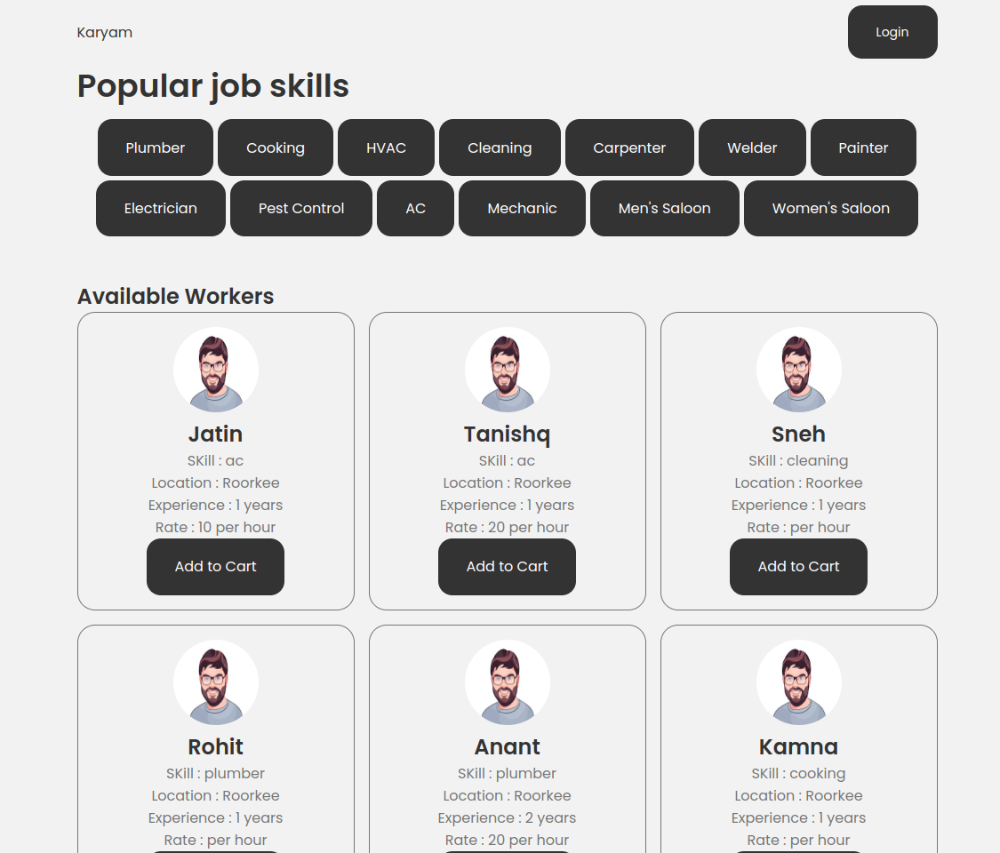

# Karyam

Karyam is a platform that connects clients with local workers for various tasks such as plumbing, carpentry, electrical work, etc.

## Features

- **User Authentication**: Users can register as clients or workers and login to access the platform.
- **Worker Profiles**: Workers can create and manage their profiles, including skills, experience, availability, etc.
- **Job Posting**: Clients can post jobs with details such as location, date, time, budget, etc.
- **Search and Discovery**: Clients can search for workers based on location, skills, and category.
- **Booking System**: Clients can add workers to their cart and book them for specific jobs.

## Technologies Used

- **Frontend**: React.js, HTML, CSS, JavaScript
- **Backend**: Node.js, Express.js, MongoDB
- **Authentication**: JSON Web Tokens (JWT)
- **Database**: MongoDB Atlas

### Future Work

- **Communication**: Clients and workers can communicate securely through in-app messaging.
- **Payment System**: Integration with payment gateway for secure online payments.
